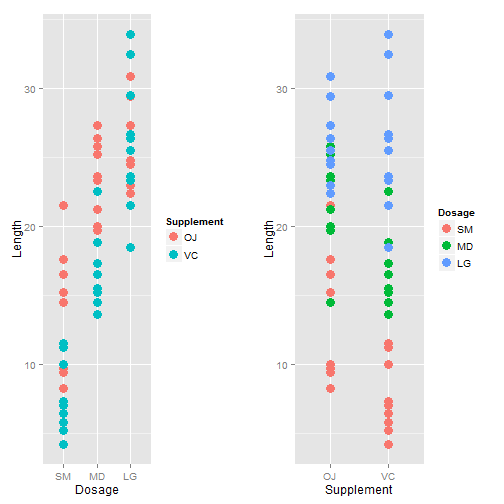

### I. OVERVIEW

This report analyzes the `ToothGrowth` data in the R data sets package. The data is the result of measuring the affect of different dosage amounts of Vitamin C on the length of odontoblasts (teeth) of ten guinea pigs.  There are two supplement types of Vitamin C tested, Orange Juice and Ascorbic Acid, and they are given in three three different milligram dosage amount, 0.5, 1.0, and 2.0.  The report goes through the process of cleansing the dataset, conducting exploratory analysis, and a completing statistical inference around different categorizations to the length of the teeth.

This report intends to perform the following data analysis aspects

* Exploratory data analysis of at least a single plot or table highlighting basic features of the data
* Conduct some relevant confidence intervals and/or tests
* Results of the tests and/or intervals interpreted in the context of the problem
* Provide a summary of the analysis and describe the assumptions needed for the conclusions

Source code for this entire report can be found here:  
https://github.com/jshiju/StatInference_Proj2

More information regarding the source dataset can be found here:   
https://stat.ethz.ch/R-manual/R-devel/library/datasets/html/ToothGrowth.html


  

### II. ANALYSIS

1(a). Load the ToothGrowth data


```r
# load data and make column names meaningful
dt<-data.table(ToothGrowth)
```

1(b). Data Cleansing

From the source, we will load the `ToothGrowth` data into a `data.table` object, change the column names to something more meaningful, and declare a join key. In order to make categorizing a little more simple, we will add an additional column for `Dosage` by converting the 0.5 dose to 'SM', the 1.0 to 'MD', and the 2.0 to 'LG'.  A single observation is shown below.

```r
# load data and make column names meaningful
dt<-data.table(ToothGrowth)
setnames(dt,c('len','supp','dose'),c('Length','Supplement','Dose'))

# add 'Dosage'and set the join key
dt<-dt[,Dosage:=sapply(as.character(dt$Dose),
                       function(x) as.factor(switch(x,'0.5'='SM','1'='MD','2'='LG')))]
setkey(dt,Supplement,Dosage)
head(dt,1)
```

```
##    Length Supplement Dose Dosage
## 1:   15.2         OJ  0.5     SM
```
  
     
1(c). Exploratory Analysis

To further conduct the exploratory analysis, we can plot `Length` against both `Dosage` and `Supplement`.  When we do this we see that the larger the `Dosage`, the longer the tooth `Length`.  However, it is slightly unclear as to which supplement is more effective, Orange Juice `OJ` or Ascorbic Acid `VC`.  
 
  

2. Basic summary of the data.

The following result sets are two a simple exploratory methods to understand the content and the structure of the `data.table` that we will continue to analyze in later sections of the report.

```r
#summary
summary(dt)
```

```
##      Length      Supplement      Dose       Dosage 
##  Min.   : 4.20   OJ:30      Min.   :0.500   SM:20  
##  1st Qu.:13.07   VC:30      1st Qu.:0.500   MD:20  
##  Median :19.25              Median :1.000   LG:20  
##  Mean   :18.81              Mean   :1.167          
##  3rd Qu.:25.27              3rd Qu.:2.000          
##  Max.   :33.90              Max.   :2.000
```

```r
# structure
str(dt)
```

```
## Classes 'data.table' and 'data.frame':	60 obs. of  4 variables:
##  $ Length    : num  15.2 21.5 17.6 9.7 14.5 10 8.2 9.4 16.5 9.7 ...
##  $ Supplement: Factor w/ 2 levels "OJ","VC": 1 1 1 1 1 1 1 1 1 1 ...
##  $ Dose      : num  0.5 0.5 0.5 0.5 0.5 0.5 0.5 0.5 0.5 0.5 ...
##  $ Dosage    : Factor w/ 3 levels "SM","MD","LG": 1 1 1 1 1 1 1 1 1 1 ...
##  - attr(*, ".internal.selfref")=<externalptr> 
##  - attr(*, "sorted")= chr  "Supplement" "Dosage"
```

```r
# dimension
dim(dt)
```

```
## [1] 60  4
```


3. Confidence Interval Testing:

In order to understand Vitamin C's affect on tooth growth, we will conduct the following confidence interval testing scenarios:  

- Dosage Alone
- Supplement Alone
- Supplement by Each Dosage

For each of the comparisons, we will subset `dt` appropriately and utilize the `t.test` R function to determine each scenarios confidence interval, subset means, and p-value.
  
     
* (a) Compare Dosage Alone

```r
t1<-subset(dt,Dosage=='SM')$Length
t2<-subset(dt,Dosage=='MD')$Length
t<-t.test(t1,t2,paired=FALSE,var.equal=FALSE)
t$conf.int[1:2]
```

```
## [1] -11.983781  -6.276219
```
If we increase the Vitamin C dose from 0.5 to 1.0 milligrams, the confidence interval does not contain zero, so we can reject the null hypothesis that this dose increase does not increase tooth length.


```r
t1<-subset(dt,Dosage=='MD')$Length
t2<-subset(dt,Dosage=='LG')$Length
t<-t.test(t1,t2,paired=FALSE,var.equal=FALSE)
t$conf.int[1:2]
```

```
## [1] -8.996481 -3.733519
```
Next, if we increase the Vitamin C dose from 1.0 to 2.0 milligrams, the confidence interval againg does not contain zero, so we can reject the null hypothesis that this dose increase does not increase tooth length.

In both of these scenarios, an increased dose amount leads to an increased tooth length.
  
* (b) Compare Supplement Alone

```r
t1<-subset(dt,Supplement=='VC')$Length
t2<-subset(dt,Supplement=='OJ')$Length
t<-t.test(t1,t2,paired=FALSE,var.equal=FALSE)
t$p.value
```

```
## [1] 0.06063451
```

```r
t$conf.int[1:2]
```

```
## [1] -7.5710156  0.1710156
```

In this single comparison, the p-value is 0.061 and the confidence interval contains zero; so, here we do not reject the null hypothesis and conclude that the type of Vitamin C supplement alone does not affect tooth growth.
  
     
* (c) Compare Supplement by Each Dosage

```r
t1<-subset(dt,Supplement=='VC' & Dosage=='SM')$Length
t2<-subset(dt,Supplement=='OJ' & Dosage=='SM')$Length
t<-t.test(t1,t2,paired=FALSE,var.equal=FALSE)
t$conf.int[1:2]
```

```
## [1] -8.780943 -1.719057
```

When we continue the analysis, and compare a 'SM' dosage of Ascorbic Acid to a'SM' dosage of Orange Juice, we see the confidence interval does not contain zero, so we can reject the null hypothesis that supplement type with a 'SM' dosage does not affect tooth growth.
  
     

```r
t1<-subset(dt,Supplement=='VC' & Dosage=='MD')$Length
t2<-subset(dt,Supplement=='OJ' & Dosage=='MD')$Length
t<-t.test(t1,t2,paired=FALSE,var.equal=FALSE)
t$conf.int[1:2]
```

```
## [1] -9.057852 -2.802148
```
Next, we compare a 'MD' dosage of Ascorbic Acid to a 'MD' dosage of Orange Juice, and, again, we see the confidence interval does not contain zero; so, we can reject the null hypothesis that supplement type with a 'MD' dosage does not affect tooth growth.
  
    

```r
t1<-subset(dt,Supplement=='VC' & Dosage=='LG')$Length
t2<-subset(dt,Supplement=='OJ' & Dosage=='LG')$Length
t<-t.test(t1,t2,paired=FALSE,var.equal=FALSE)
t$p.value
```

```
## [1] 0.9638516
```

```r
t$conf.int[1:2]
```

```
## [1] -3.63807  3.79807
```

Lastly, we compare a 'LG' dosage of Ascorbic Acid to a 'LG' dosage of Orange Juice; this time, however, we observer the confidence interval contains zero and there is a p-value of almost 1.0.  In turn, we do not reject the null hypothesis that supplement type with a 'LG' dosage does not affect tooth growth.  Meaning, with a 'LG' Dosage, we cannot conclude which supplement type has a greater affect on tooth growth.
  
### III. SUMMARY    
4(a). Conclusions

1. As Vitamin C dose size alone increases, the tooth length increases as well, and
2. Irrespective of dose size, supplement type alone does not affect tooth growth; however,
3. The supplement type of Orange Juice, or 'OJ', affects tooth length greater then Ascorbic Acid, or 'VC', with a 0.5 and 1.0 dose size, in turn, 
4. When the dose size reached 2.0 milligrams, there is no difference between Orange Juice and Ascorbic Acid.
  
     
4(b). Assumptions

1. The confidence intervals are assumed to not be paired, i.e. we are not comparing two different supplement types from individual guinea pig.
2. The samples are independent.
3. The distribution approximately is normal.
